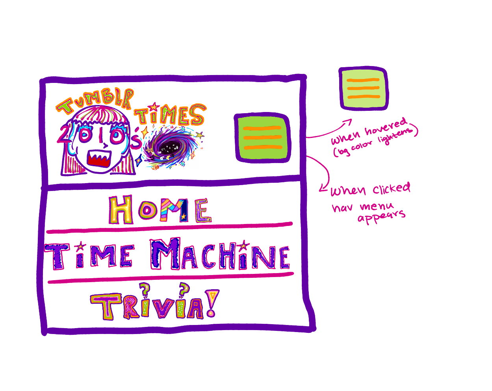
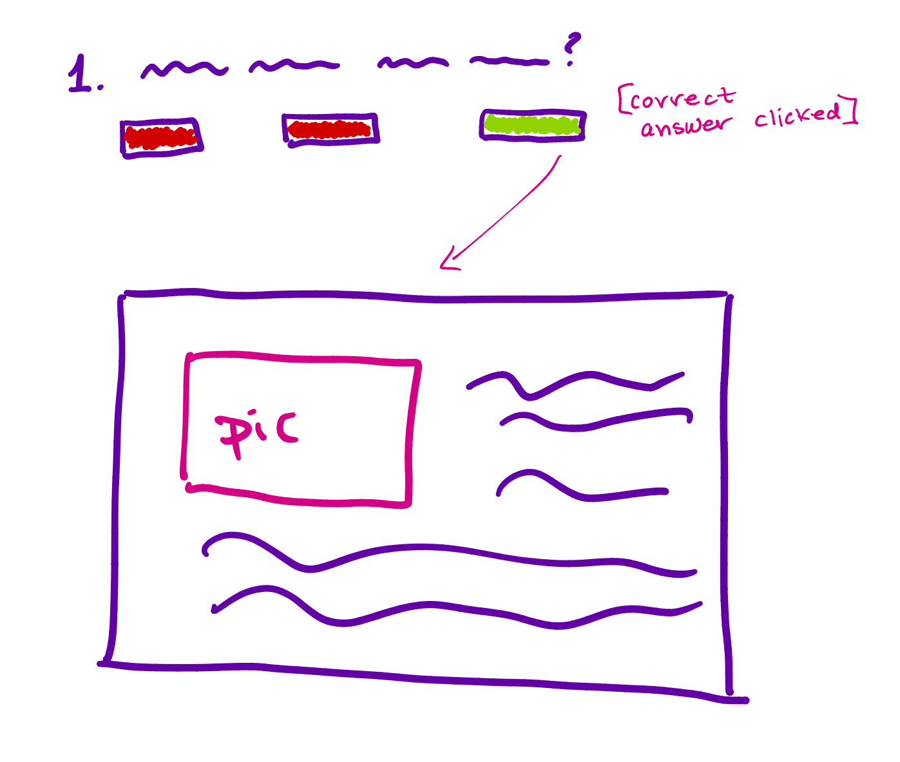
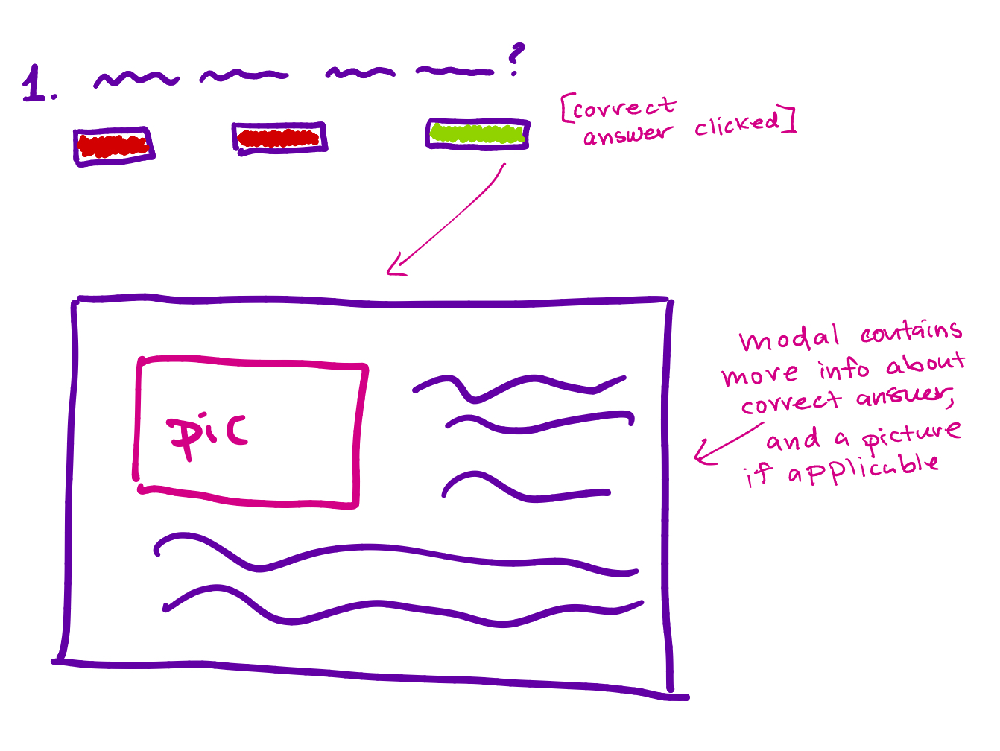
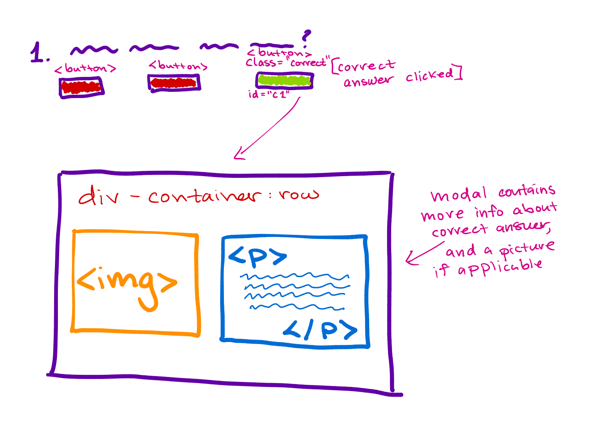
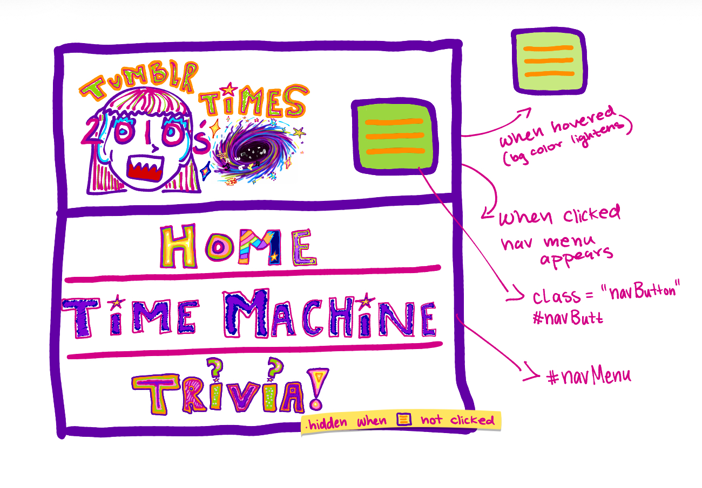

# Project, Milestone 3: Design Journal

[← Table of Contents](journal.md)


> **Replace ALL _TODOs_ with your work.** (There should be no TODOs in the final submission.)
>
> Be clear and concise in your writing. Bullets points are encouraged.
>
> Place all design journal images inside the "design-plan" folder and then link them in Markdown so that they are visible in Markdown Preview.
>
> **Everything, including images, must be visible in _Markdown: Open Preview_.** If it's not visible in the Markdown preview, then we can't grade it. We also can't give you partial credit either. **Please make sure your design journal is easy to read for the grader** (no side-ways images, etc.); in Markdown preview the **question _and_ answer should have a blank line between them**.


## Modal Interactivity Brainstorm
> Using the audience goals you identified, brainstorm possible options for **modal** interactivity to enhance the functionality of the site while also assisting the audience with their goals.
> Briefly explain each idea. (1 sentence)
> Note: You may find it easier to sketch for brainstorming. That's fine too. Do whatever you need to do to explore your ideas.
>
- I think that using modals for the aesthethic collages would make sense so that the user can clearly see the collage.
- Using a modal for the correct trivia answer would also be a cool idea because it can explain why that's the correct answer.


## Interactivity Design Ideation
> Explore the possible design solutions for the interactivity.
> Sketch (design sketch) at least one idea for the modal and at least one idea for the hamburger menu interactivity.
> Annotate each sketch explaining what happens when a user takes an action. (e.g. When user clicks this, something else appears.)
> Do not include HTML/CSS annotations in your sketches!

- 
- 


## Final Interactivity Design Sketches
> Create _polished_ design sketch(es) (it's still a sketch, but with a little more care taken to communicate ideas clearly to the graders) to plan your interactivity.
> Add annotations to explain what happens when the user takes an action.
> Include as many sketches as necessary to communicate your design (ask yourself, could another 1300 take these sketches an implement my design?)

**Modal design sketches:**
> 


**Hamburger drop-down navigation menu design sketches:**
> 


## Interactivity Rationale
> Describe the purpose of your proposed interactivity.
> Provide a brief rationale explaining how your proposed interactivity addresses the goals of your site's audience.
> This should be about a paragraph. (2-3 sentences)
>
> I think that the hamburger navigation just follows best practices and will make navigation more accessible for the user. I think that the modal interactivity, specifically for the trivia questions will be helpful because it will give more information to the user about why the correct answer is right. I think that this is just an overall good idea because it creates more clarity within the audience.


## Interactivity Planning Sketches
> Produce planning sketches that include all the details another 1300 student would need to implement your interactivity design.
> Your planning sketches should include _all_ HTML elements needed for the interactivity; _annotations_ for the element types, their unique IDs, and CSS classes; and lastly the initial CSS classes.

**Modal planning sketches:**
> 

**Hamburger drop-down navigation menu planning sketches:**
> 


## Interactivity Pseudocode Plan
> Write your interactivity pseudocode plan here.
> Pseudocode is not JavaScript. Do not put JavaScript code here.

**Modal pseudocode:**

> Pseudocode to open the modal:

```
if #c1 is clicked:
  remove .hidden from #modal
```

> Pseudocode to close the modal:

```
when #exit is clicked:
  add .hidden to #modal
```

**Hamburger menu pseudocode:**

> Pseudocode to show/hide (toggle) the navigation menu (narrow screens) when the hamburger button is clicked:

```
when the hamburger button is clicked:
  if the navigation menu is not visible:
    remove .hidden from #navMenu
  else:
    add .hidden to #navMenu
```

> If the browser window is wide when the page loads, the hamburger button should not be visible.
> Showing and hiding the hamburger button should be accomplished using media queries.
>
> However, JavaScript should be used for the navigation menu's visibility.
> If the browser window is narrow when the page loads, the navigation should be hidden.
> Complete the pseudocode to show/hide (toggle) the navigation on page load:

```
on page load (ready):
  if window is narrow:
    add .hidden to #navMenuWide
    remove .hidden from #navButt
   else if window is wide:
     add .hidden to #navButt
     remove .hidden from #navMenuWide
```

> If the browser window is resized from wide to narrow, the navigation should be hidden.
> If the browser window is resized from narrow to wide, the navigation should be visible.

```
on window resize:
  if window is narrow:
    add .hidden to #navMenuWide
    remove .hidden from #navButt
  else if window is wide:
    add .hidden to #navButt
    remove .hidden from #navMenuWide
```


## References

### Collaborators
> List any persons you collaborated with on this project.


### Reference Resources
> Did you use any resources not provided by this class to help you complete this assignment? (Do not list the course resources or the Mozilla documentation.)
> List any external resources you referenced in the creation of your project. (i.e. ChatGPT, etc.)
>
> Provide the URL to the resources you used and include a short description of how you used each resource.


[← Table of Contents](journal.md)
